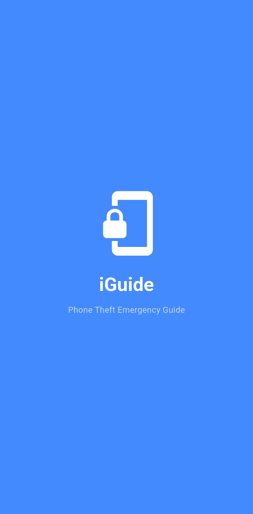
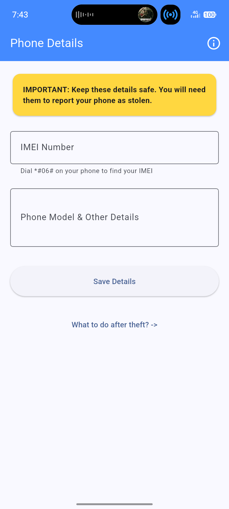
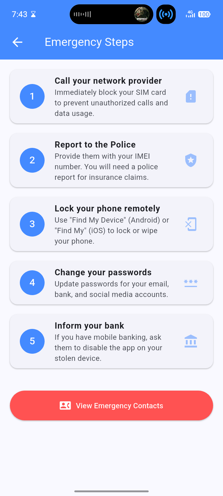
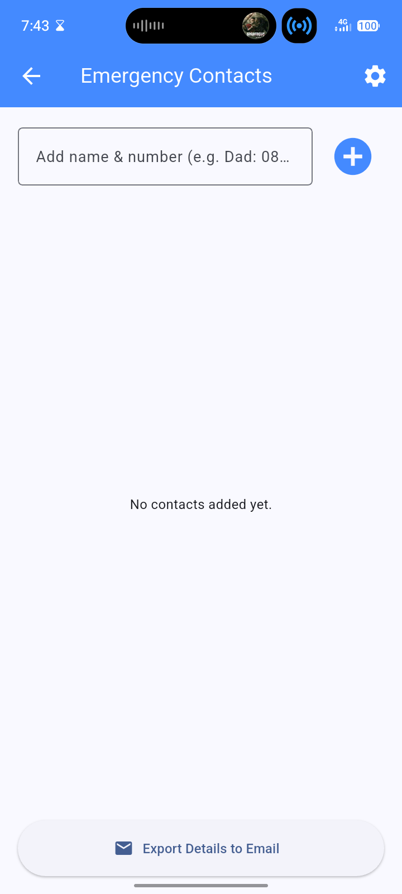
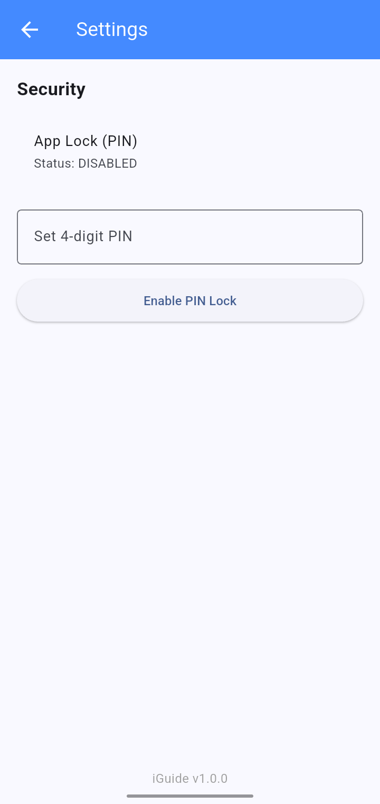

# iGuide - Phone Theft Emergency Guide App

iGuide is a simple but powerful mobile application designed to help users prepare for and manage phone theft emergencies. It allows users to store critical phone information securely and provides a clear guide on the steps to take if their phone is stolen.

## App Screenshots

<p align="center">
  
  
  
  
  
</p>

## Key Features

- **Store IMEI and Phone Details**: Keep your phone's unique identification number and description safe within the app.
- **Emergency Steps Guide**: A step-by-step checklist of what to do immediately after a theft.
- **Emergency Contacts**: Store names and numbers of people to contact in an emergency.
- **Export to Email**: Easily export your IMEI, phone details, and emergency contacts to an email address for safe keeping.
- **PIN Lock**: Secure the app with a 4-digit PIN to prevent unauthorized access to your stored information.

## Folder Structure

- `lib/main.dart`: Entry point of the app, handles theme and root widget.
- `lib/screens/`: Contains all the app screens.
  - `splash_screen.dart`: Animated entry screen.
  - `imei_entry_screen.dart`: Storage for phone identification details.
  - `emergency_steps_screen.dart`: Informational guide for theft recovery.
  - `contacts_screen.dart`: Management of emergency numbers and export feature.
  - `settings_screen.dart`: Security settings for PIN lock.
- `lib/services/`:
  - `storage_service.dart`: Handles local data persistence using `shared_preferences`.
- `lib/widgets/`:
  - `pin_lock_screen.dart`: Security wrapper to lock the app.

## Installation Steps

1.  Ensure you have [Flutter](https://docs.flutter.dev/get-started/install) installed on your machine.
2.  Clone this repository or download the source code.
3.  Navigate to the project directory:
    ```bash
    cd iguide
    ```
4.  Install dependencies:
    ```bash
    flutter pub get
    ```

## How to Run the App

- To run on a connected device or emulator:
  ```bash
  flutter run
  ```
- To build for Android:
  ```bash
  flutter build apk
  ```
- To build for iOS:
  ```bash
  flutter build ios
  ```

## Challenges Encountered

- **App Branding Caching**: Changing the app icon and splash screen didn't immediately reflect in the build. This was due to both Flutter's build cache and deep OS-level caching on Android.
- **Mobile Responsiveness**: Designing a premium web landing page that looks equally good on desktop and high-density mobile screens required specific attention to CSS breakpoints and touch-friendly interaction patterns.
- **Native Configuration**: Managing native platform code for splash screens across Android 12+ (Adaptive Icons) and earlier versions while maintaining a consistent brand identity.

## Solutions Implemented

- **Branding Refresh**: Used `flutter_launcher_icons` and `flutter_native_splash` to programmatically generate all required platform-specific assets. Followed this with `flutter clean` and full app uninstallation to force the OS to refresh cached icons.
- **Responsive Landing Page**: Built a standalone `website/` directory using modern Vanilla CSS with a mobile-first approach. Implemented vertical stacking and full-width buttons for smaller viewports (under 576px).
- **Automated APK Delivery**: Integrated a direct APK download link on the landing page by copying the release build into the website deployment folder, ensuring a seamless user acquisition flow.
